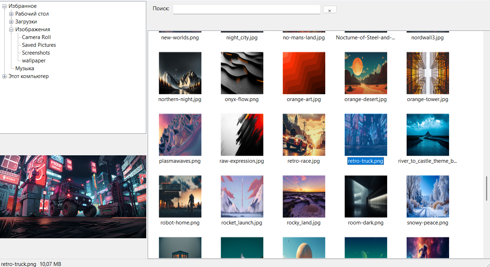

# Photo Explorer

Фото-проводник для просмотра изображений с кешированием и полноэкранным режимом. Аналог FastStone Image Viewer.



## Возможности

- Навигация по папкам
- Миниатюры (превью) изображений
- Кеш миниатюр в SQLite (ускорение работы)
- Поиск по имени файла
- Полноэкранный просмотр выбранного файла

## Технологии

- C#
- .NET 8.0
- WPF
- SQLite

## Запуск

```bash
git clone <ссылка>
открыть .sln в Visual Studio
F5 (сборка и запуск)
```
